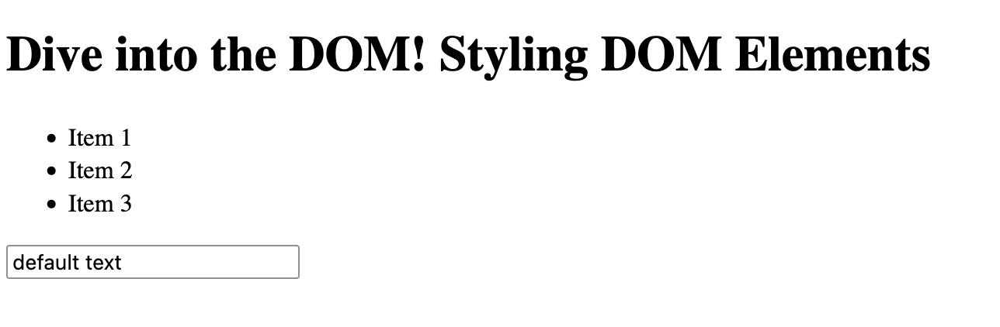
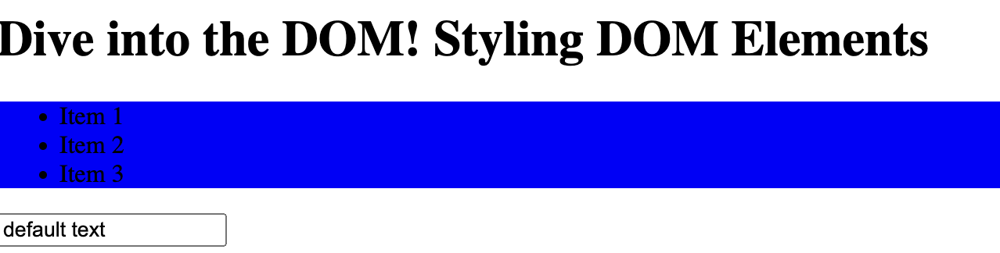
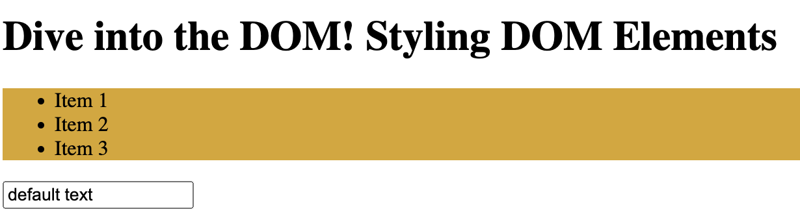

# Styling DOM elements

The following personal notes are based on the [Udemy course by Maximilian Schwarzmüller](https://www.udemy.com/course/javascript-the-complete-guide-2020-beginner-advanced/).

At the start, we have a simple html page that includes a header, a section with an unordered list, and an input field.

```html
<!DOCTYPE html>
<html lang="en">
  <head>
    <meta charset="UTF-8" />
    <meta name="viewport" content="width=device-width, initial-scale=1.0" />
    <meta http-equiv="X-UA-Compatible" content="ie=edge" />
    <title>DOM Interaction</title>
    <script src="app.js" defer></script>
  </head>
  <body>
    <header><h1 id="main-title">Dive into the DOM! Styling DOM Elements</h1></header>
    <section class="red-bg visible">
      <ul>
        <li class="list-item">Item 1</li>
        <li class="list-item">Item 2</li>
        <li class="list-item">Item 3</li>
      </ul>
    </section>
    <input type="text" value="default text" />
  </body>
</html>
```
`app.js` does very little for now besides a `console.log` statement.

```javascript
const ul = document.body.firstElementChild.nextElementSibling;
const firstLi = ul.firstElementChild;

console.log(firstLi);

const section = document.querySelector('section');
```

At the start, our basic page looks like this:



## Basic Styling

For a quick play with the DOM, we can change the background color of the section element directly in our browser's console with something like `section.style.backgroundColor = 'blue';`, changing the background color to blue:



Now, let's add some css classes to our html file:

```html
    <style>
      .goldenrod-bg {
        background-color: goldenrod;
        color: black;
      }

      .visible {
        display: block;
      }

      .invisible {
        display: none;
      }
```

That is not all, we also need to prepend the class `goldendrod-bg` to the section element:

```html
    <section class="red-bg goldenrod-bg">
```


We can manipulate this further directly in our app.js file. Let's say we want to remove the color:

```javascript
section.className=''
```
which will take us back to the very first screenshot.

Finally, let's add a button to switch between the `visble` and `invisible` classes:

```html
<button id="toggle-visibility">Toggle visibility</button>
```

In our `app.js` file we have to add the following:

```javascript
const button = document.getElementById('toggle-visibility');

button.addEventListener('click', () => {
  if (section.className === 'goldenrod-bg visible') {
    section.className = 'goldenrod-bg invisible'
  } else {
    section.className = 'goldenrod-bg visible';
  }
});
```

```javascript
const button = document.getElementById('toggle-visibility');

button.addEventListener('click', () => {
  section.classList.toggle('visible');
  section.classList.toggle('invisible');
});
```

This is saving us a couple of lines and is easier to read compared to the `if` statement from before! Overall, `classList` (and `className`) allows to add and remove classes more dynamically compared to inline styles.